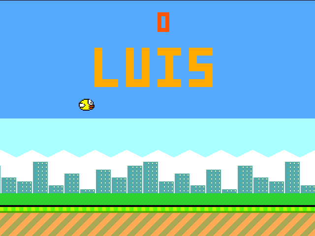
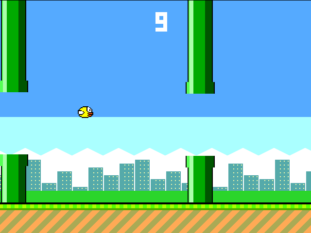
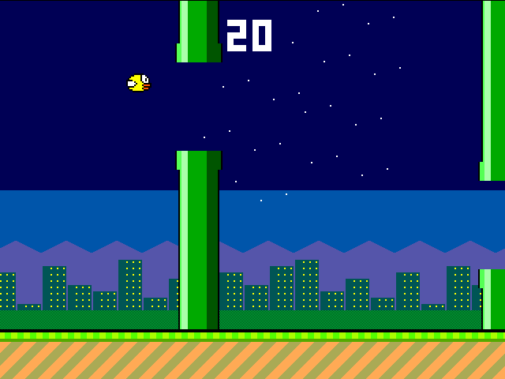
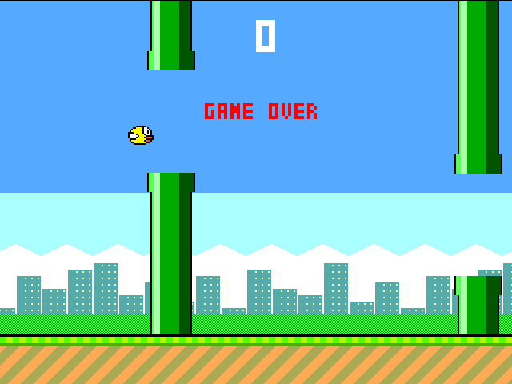

## How it works

**Flappy Luis** is a complete Flappy-style video game implemented in hardware. There is no CPU and no
software: every pixel is computed on the fly by logic gates while the VGA beam scans the screen
(640x480 at 60 Hz, 25.175 MHz pixel clock).

### The game

- **Title screen**: the big "LUIS" title, the bird bobbing in place and, at the top, the best
  score in orange.
- **Playing**: flap to fly through the gaps between the pipes. Each pipe you pass is one point.
- **Levels**: every 10 points the game gets harder.

| Score | Gap between the pipes | Pipe speed | Sky |
|-------|-----------------------|------------|-----|
| 0-9   | 128 px | 3 px per frame | day |
| 10-19 | 112 px | 3 px per frame | day |
| 20-29 | 112 px | 4 px per frame | night, with twinkling stars and lit windows |
| 30+   | 96 px  | 4 px per frame | night |

- **Game over**: when the bird touches a pipe or the ground, the screen flashes, the bird falls and
  "GAME OVER" appears under the score. Press again to go back to the title screen.
- **Sound** (1-bit, on `uio[7]`): a chirp for every flap, a two-tone "ding" for every point and
  noise when you crash.

### The hardware

- **VGA timing** (`hvsync_generator`): horizontal and vertical counters that produce `hsync`, `vsync`
  and the current pixel position.
- **Game logic**, updated once per frame during vertical blanking:
  - the bird has a 9.2 fixed-point height and a signed velocity, with gravity and a flap impulse;
  - two pipes scroll left and respawn on the right with a random gap from a 10-bit LFSR. They are
    always 384 px (6 x 64) apart, so they share one position register and one renderer;
  - the score and the best score are kept as BCD digits (0-99); the level comes from the tens digit;
  - collisions are pixel-perfect: if a bird pixel is drawn on top of a pipe pixel, the bird crashes;
  - a state machine: title screen, playing, and game over.
- **Renderer**, evaluated for every pixel, from front to back: text (3x5 pixel font: score, "LUIS",
  "GAME OVER"), the 16x12 bird sprite, the pipes with caps, outlines and shading, the ground with
  stripes that scroll with the pipes, and the background: sky (or a starry night sky), clouds and a
  city skyline scrolling slower than the pipes (parallax), with bushes in front.
- **Sound**: the scanline counter doubles as the tone generator (bit k of the line number is a
  square wave of 31469 / 2^(k+1) Hz), so the sound costs almost no extra logic.

The renderer is written as a chain of `if` / `else` blocks that call small functions (bird, pipe,
text, ground, background). The hardware is the same as with plain `?:` expressions, but a
cycle-based simulator only evaluates the layer that is visible at each pixel, so the game runs
about twice as fast in the [VGA Playground](https://vga-playground.com/) as the first version.

## How to test

Connect a TinyVGA Pmod to the outputs and a VGA monitor, and set the clock to 25.175 MHz
(25.2 MHz also works).

- Flap: flip the `ui[0]` switch (every change of `ui[0]` is one flap), or press a push button
  connected to `ui[2]` (one flap per press).
- The game starts with the first flap. Fly through the gaps; every 10 points the level goes up.
- After a crash, flap again to go back to the title screen, which shows the best score.

You can also play it in the browser with the Tiny Tapeout VGA Playground:
`https://vga-playground.com/?repo=https://github.com/Lulago3003/tt-flappy-luis`.
Press `0` on the keyboard to flap. Turn on the audio button to hear the sound.

## External hardware

- [TinyVGA Pmod](https://github.com/mole99/tiny-vga) on the output pins, and a VGA monitor.
- Optional: a push button on `ui[2]`.
- Optional: an audio Pmod or a small speaker/amplifier on `uio[7]` for sound.
