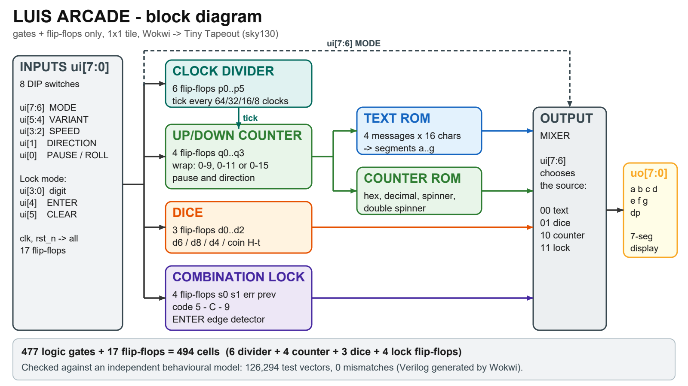

## How it works

**LUIS ARCADE** packs 16 small "games and gadgets" into one tiny chip. Everything is shown on a single
7-segment display (segments `a`-`g` plus the decimal point `dp`) and everything is built only from
**477 logic gates and 17 flip-flops** (494 cells, one 1x1 tile). It was drawn in Wokwi and checked against an
independent behavioural model (126,294 test vectors, 0 mismatches).

Two switches choose the **mode** (`ui[7:6]`) and two more choose the **variant** (`ui[5:4]`):

| MODE `ui[7:6]` | What it does | Variant `00` | Variant `01` | Variant `10` | Variant `11` |
|---|---|---|---|---|---|
| `00` Sign | shows a 16-character message, one character at a time | HOLA LUIS CHIP | TINY TAPEOUT | SUERTE LUIS 2026 | FLAPPY LUIS |
| `01` Dice | rolls a die or flips a coin | d6 (1 to 6) | d8 (1 to 8) | d4 (1 to 4) | coin (H / t) |
| `10` Counter | counts up or down | hexadecimal 0-F | decimal 0-9 | spinner (12 steps) | double spinner |
| `11` Safe | 3-digit combination lock | - | - | - | - |

Controls in each mode:

| Pin | Sign and Counter | Dice | Safe |
|---|---|---|---|
| `ui[0]` | PAUSE (1 = freeze, dot stays on) | ROLL (hold to roll, release to stop) | digit bit 0 |
| `ui[1]` | DIRECTION (0 = forward / up, 1 = backward / down) | not used | digit bit 1 |
| `ui[3:2]` | SPEED | not used | digit bits 3 and 2 |
| `ui[4]` | VARIANT bit 0 | VARIANT bit 0 | ENTER (rising edge) |
| `ui[5]` | VARIANT bit 1 | VARIANT bit 1 | CLEAR |
| `ui[7:6]` | MODE | MODE | MODE |

Speed (`ui[3:2]`) is the number of clock cycles per step: `00` = 64, `01` = 32, `10` = 16, `11` = 8.
With a 128 Hz clock that is 2, 4, 8 or 16 steps per second.

The design has seven blocks:

1. **Clock divider**: a 6-bit binary counter (6 flip-flops). A `tick` is produced every 64, 32, 16 or 8 clocks
   (chosen by `ui[3:2]`) and is blocked while `ui[0]` (PAUSE) is high. The top bit also drives the blinking decimal point.
2. **Up/down counter**: a 4-bit counter (4 flip-flops) that moves on every tick. Direction comes from `ui[1]`.
   It wraps at 15 (hex), at 9 (decimal) or at 11 (spinners), and also wraps backwards (0 goes to 9 or 11).
   In Sign mode it is the index of the character being shown.
3. **Text ROM**: 4 messages x 16 characters, decoded to the 7 segments with a 16-way decoder and OR gates.
4. **Counter ROM**: the four counter display tables (hex, decimal, one spinning segment, two opposite spinning segments).
5. **Dice**: a 3-bit counter (3 flip-flops) that runs at the full clock rate while ROLL is held, so the face you
   get depends on when you let go. It wraps after face 6 (d6), 8 (d8), 4 (d4) or 2 (coin).
6. **Combination lock**: a small state machine (2 state flip-flops, 1 error flip-flop and 1 flip-flop that remembers the
   previous ENTER level to detect its rising edge). The secret code is **5 - C - 9**.
7. **Output mixer**: AND-OR gates that pick the active source with the decoded `ui[7:6]` and drive `uo[7:0]`.

Display of the safe: `-` = locked, `1` = first digit accepted, `2` = second digit accepted, `O` plus the dot = open,
`E` = wrong digit (everything starts again).

## How to test

1. Power the board and set the project clock to about **128 Hz** (any frequency from 50 Hz to a few kHz works, it only changes the speed).
2. Pulse **reset** (`rst_n` low) once. All 17 flip-flops go to 0.
3. **Sign**: all switches OFF. The display shows H, O, L, A, (blank), L, U, I, S, (blank), C, H, I, P ... in a loop, one every 0.5 s.
   Switch `ui[0]` ON to pause, `ui[1]` ON to run backwards, `ui[3:2]` to speed up, `ui[5:4]` to change the message.
4. **Dice**: set `ui[7:6]` = `01` (switch 7 ON). Turn `ui[0]` ON and OFF: the display stops on a random face
   (the dot is lit while it rolls). Change `ui[5:4]` for d6, d8, d4 or coin.
5. **Counter**: set `ui[7:6]` = `10` (switch 8 ON). It counts up; `ui[1]` ON counts down; `ui[5:4]` selects hex, decimal, spinner or double spinner.
6. **Safe**: set `ui[7:6]` = `11` (switches 7 and 8 ON). The display shows `-`.
   Put the digit on `ui[3:0]` as a binary number and raise then lower `ui[4]` (ENTER).
   - Digit 1 = **5** = `0101`, then ENTER: the display shows `1`.
   - Digit 2 = **C** = `1100`, then ENTER: the display shows `2`.
   - Digit 3 = **9** = `1001`, then ENTER: the display shows `O` with the dot lit (open).
   - Any wrong digit shows `E` and starts again. `ui[5]` (CLEAR) locks it again at any time.

You can also try the chip online without any hardware: open the Wokwi project
<https://wokwi.com/projects/476711427277175809>, press the green Play button, press the RESET button once,
then flip the DIP switches and watch the display.

## External hardware

None. It only uses the 8 input DIP switches (`ui_in`) and the 7-segment display (`uo_out`) of the Tiny Tapeout demo board.

## Resumen en español

LUIS ARCADE es un chip con 16 funciones en una sola pantalla de 7 segmentos, hecho solo con compuertas lógicas y flip-flops.
Los interruptores 8 y 7 eligen el modo (letrero, dado, contador o caja fuerte) y los interruptores 6 y 5 eligen la variante.
La caja fuerte se abre con el código 5 - C - 9. Autor: Luis Lasso.
